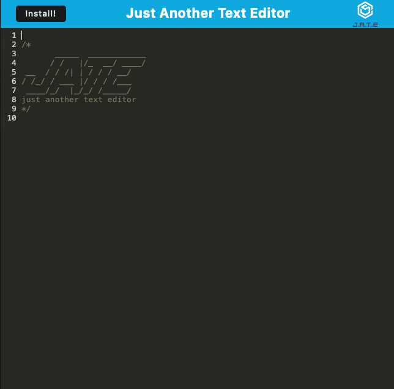

# Simply Just Another Text Editor

This is a simple text editor that you can use offline, and it's also a Progressive Web App (PWA) that you can install on your device, it uses IndexedDB to keep your text safe and sound, even if your internet connection goes down

## Description

This web app is like a training exercise to make a Progressive Web Application (PWA) that you can install on your device and keep using even if you don't have internet access. Data is kept in a local file called IndexedDB instead of being stored in DOM Storage because IndexedDB can handle larger and more organized data files better.

## Installation

To install locally, click the "Install" button in the upper left

To uninstall in Chrome, click on the three vertical dots and select uninstall

## User Story

```md
AS A developer
I WANT to create notes or code snippets with or without an internet connection
SO THAT I can reliably retrieve them for later use
```

## Acceptance Criteria

```md
GIVEN a text editor web application
WHEN I open my application in my editor
THEN I should see a client server folder structure
WHEN I run `npm run start` from the root directory
THEN I find that my application should start up the backend and serve the client
WHEN I run the text editor application from my terminal
THEN I find that my JavaScript files have been bundled using webpack
WHEN I run my webpack plugins
THEN I find that I have a generated HTML file, service worker, and a manifest file
WHEN I use next-gen JavaScript in my application
THEN I find that the text editor still functions in the browser without errors
WHEN I open the text editor
THEN I find that IndexedDB has immediately created a database storage
WHEN I enter content and subsequently click off of the DOM window
THEN I find that the content in the text editor has been saved with IndexedDB
WHEN I reopen the text editor after closing it
THEN I find that the content in the text editor has been retrieved from our IndexedDB
WHEN I click on the Install button
THEN I download my web application as an icon on my desktop
WHEN I load my web application
THEN I should have a registered service worker using workbox
WHEN I register a service worker
THEN I should have my static assets pre cached upon loading along with subsequent pages and static assets
WHEN I deploy to Heroku
THEN I should have proper build scripts for a webpack application
```

## Credits

- Chelsea Wagner -https://github.com/caf62219 - starting code and general setup
- Donnie Rowlings - https://github.com/drawlin22 - starting code and general setup
- Kyle Jocoy - https://github.com/Kylyote - starting code and general setup

## ScreenShot:
   


## Links:

- Repository:
  https://github.com/ColtonMakesStuff/PWA-text-editor/settings/pages
- Heroku deploy:
  https://colton-text-editor-d34550b80c1a.herokuapp.com